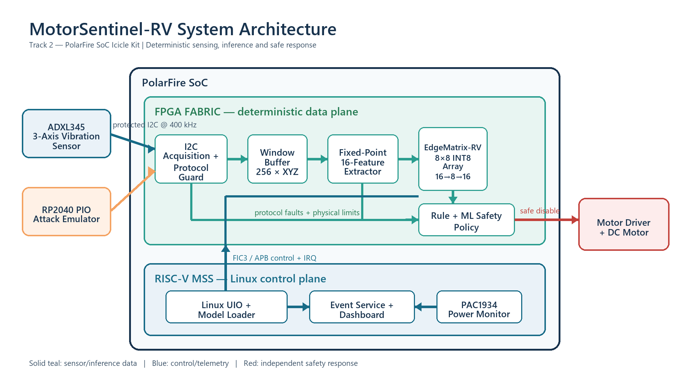

# MotorSentinel-RV

**Track 2 — Connected Real-Time Systems using the PolarFire SoC Icicle Kit**

MotorSentinel-RV is an attack-resilient predictive-maintenance architecture for industrial motors. It combines protected I2C vibration acquisition, streaming fixed-point feature extraction, an INT8 systolic autoencoder, and an FPGA-resident safety policy. The PolarFire SoC RISC-V subsystem provides model management, telemetry, event visualization, and the CPU comparison path, while the time-critical detection and motor-disable path remains in FPGA fabric.

## System block diagram

[Download the system block diagram as PDF](docs/MotorSentinel-RV_System_Block_Diagram.pdf)

## Proposed data path

1. Acquire three-axis vibration samples over a monitored I2C bus.
2. Detect protocol faults, missing samples, frozen data, and replay candidates.
3. Generate 16 fixed-point vibration features from overlapping windows.
4. Execute a quantized `16 → 8 → 16` autoencoder using an 8×8 INT8 systolic array.
5. Combine protocol flags, physical limits, and reconstruction error in a deterministic safety policy.
6. Invalidate suspect data, raise an interrupt, and disable the demonstration motor directly from FPGA fabric.

## Status

Proposal-stage technical architecture. Performance, power, utilization, and detection targets will be validated through simulation and hardware measurements on the PolarFire SoC Icicle Kit.
